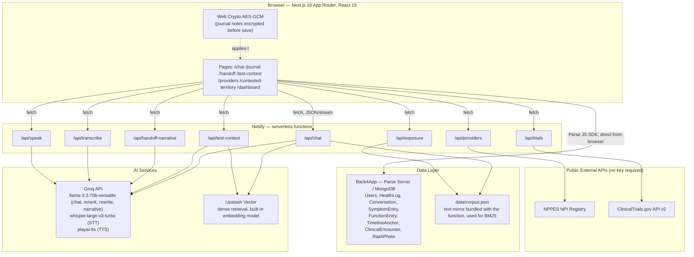
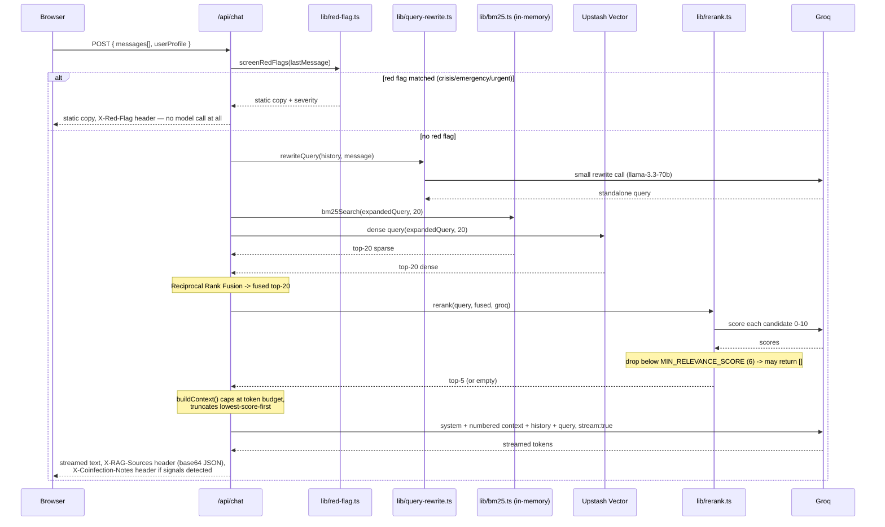
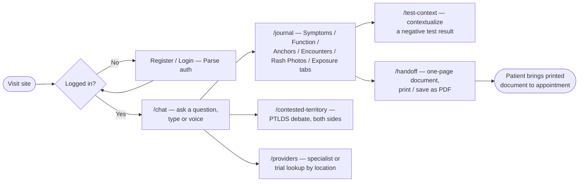
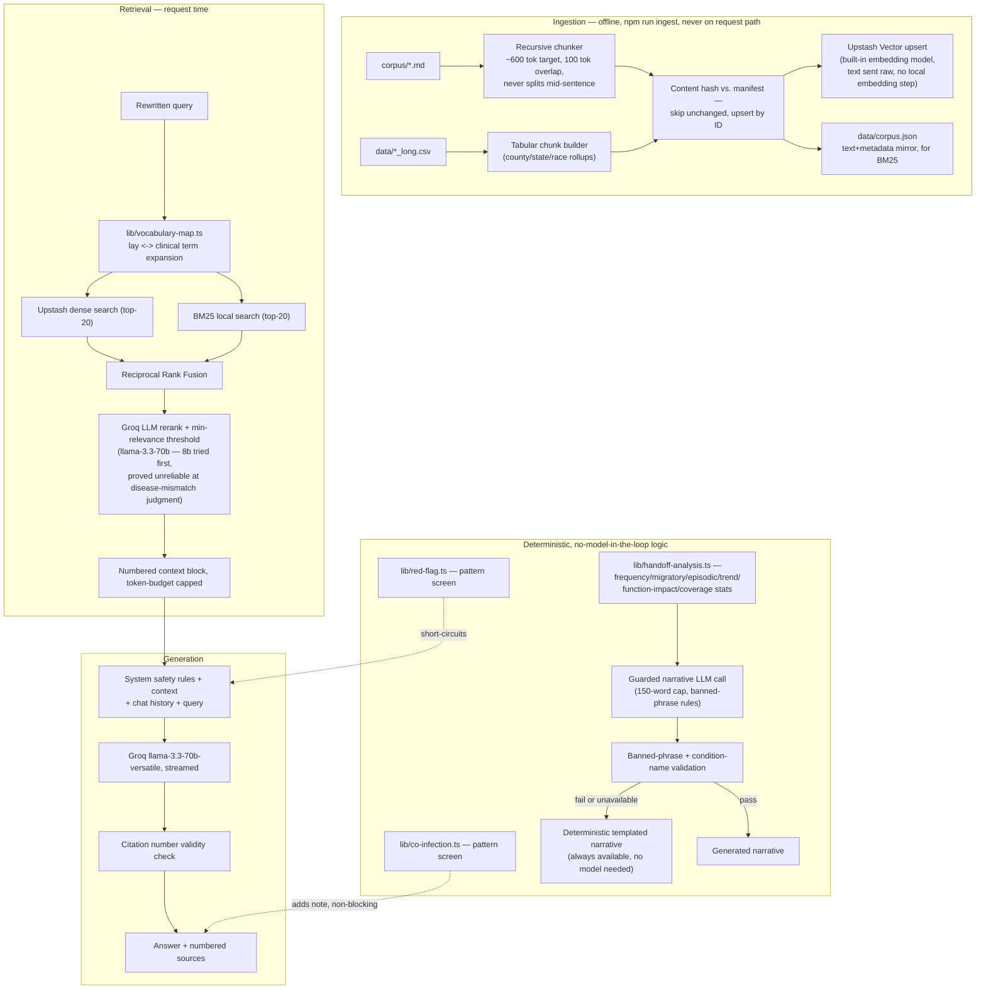
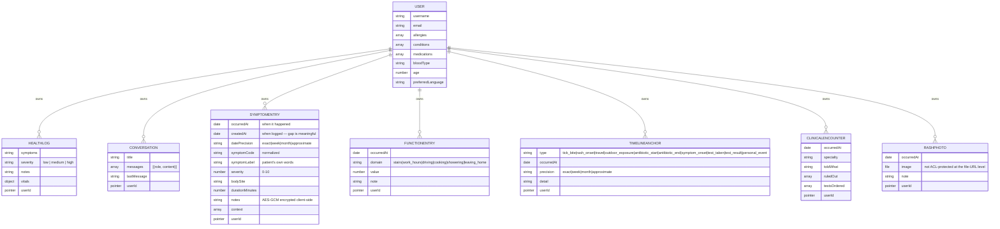
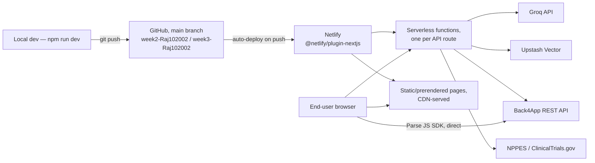

# design.md — ClearSignal Technical Design

This document describes how ClearSignal is actually built as of this snapshot of
the build phase. Diagrams are Mermaid (renders natively on GitHub). Where a
described component is not yet implemented, it's labeled **[PLANNED]** rather
than presented as done — see `plan.md` for the build-phase items still ahead.

---

## 1. System Architecture

**Note on the auth/data path:** the browser talks to Back4App directly via the
Parse JS SDK (not proxied through a Netlify function) for all CRUD on
`HealthLog`, `Conversation`, and the five journal classes. This is the same
pattern the project started with — Back4App issues session tokens and enforces
ACLs server-side, so there's no meaningful security reason to add a proxy layer
in front of it, and doing so would add latency for no benefit.

---

## 2. Data Flow — RAG Chat Request

The core AI feature. Every other AI-calling route (`/api/test-context`,
`/api/handoff-narrative`) follows a smaller version of the same shape: red flag
check where applicable → retrieval where applicable → generation → validation.

**Failure/fallback behavior actually implemented:**
- Empty retrieval (nothing clears the relevance bar) → the model is instructed
  to say it doesn't have that information rather than answer from parametric
  knowledge, per the system prompt in `lib/generation.ts`.
- Malformed rerank JSON from Groq → falls back to raw RRF fusion order rather
  than failing the request (`lib/rerank.ts`).
- Query rewrite failure → falls back to the raw user message (`lib/query-rewrite.ts`).
- TTS failure → falls back to the browser's `SpeechSynthesis` API (`hooks/useSpeechOutput.ts`).
- Handoff narrative generation failure or banned-phrase/condition-name violation
  → falls back to a fully deterministic templated summary (`lib/handoff-narrative.ts`).

**Caching: [PLANNED, not implemented].** There is currently no cache in front
of Groq calls or Upstash queries. Given the free-tier daily token limit is easy
to exhaust (documented in `plan.md`'s cost section), caching repeated/similar
queries is a real near-term item, not a nice-to-have.

---

## 3. User Flow

---

## 4. AI Component Diagram

**Agentic AI patterns: honestly, mostly absent.** This is a fixed multi-stage
*pipeline* (screen → rewrite → retrieve → rerank → generate → validate), not an
agent that dynamically selects tools or maintains cross-session memory beyond
the chat history array already in the request. There is no function-calling
loop where the model decides what to do next. Calling this "agentic" would be
overclaiming. The closest things to agentic behavior are (a) the reranker
making a judgment call about relevance, and (b) the query rewriter resolving
follow-up references — both single-shot LLM calls with a fixed role, not a
multi-step autonomous loop. If the build phase adds real agentic behavior, it
would most plausibly be a "search my journal for patterns" feature where the
model plans which deterministic analysis functions to call — see `plan.md`.

---

## 5. Database Schema (Back4App / Parse)

Every class below uses `new Parse.ACL(user)` at creation time, which restricts
both read and write to that one authenticated user — verified against every
save path in `lib/parse-client.ts` and `lib/journal-client.ts`. See
`docs/privacy.md` in the implementation repo for the full detail, including the
two real limitations (master-key bypass, and `RashPhoto.image` file URLs not
being ACL-protected the way the owning record is).

**Indexes: [PARTIALLY PLANNED].** Parse Server auto-indexes `objectId` and
`createdAt`. All list queries filter on `userId` and sort on `occurredAt`
(`lib/journal-client.ts`), so a compound index on `(userId, occurredAt)` per
class would meaningfully speed up queries at scale — not yet explicitly
configured in the Back4App dashboard. This is a Production Engineering item in
`plan.md`, not done.

**Connection pooling / backups:** handled at the Back4App platform level (managed
MongoDB); no custom configuration has been done on this project's part.

---

## 6. API Architecture

All routes are Next.js App Router route handlers (`app/api/*/route.ts`),
deployed as individual Netlify functions. None currently have OpenAPI/Swagger
docs generated — this table is the source of truth today.

| Route | Method | Request | Response | Notes |
|---|---|---|---|---|
| `/api/chat` | POST | `{ messages: {role,content}[], userProfile? }` | `text/plain` stream; headers `X-RAG-Sources` (base64 JSON), `X-Coinfection-Notes` (base64 JSON, optional), `X-Red-Flag` (severity, on short-circuit) | Red-flag screened before any model call. Rate limiting: none yet on this route specifically — **[GAP, see plan.md]**. |
| `/api/transcribe` | POST | `multipart/form-data`: `audio` (File), `language?` | `{ text: string }` | Groq `whisper-large-v3-turbo`, prompt-seeded with domain vocabulary. Rate-limited (30 req / 10 min / IP). |
| `/api/speak` | POST | `{ text: string }` | `audio/mpeg` binary | Groq `playai-tts`. Rate-limited (30 req / 10 min / IP). Client falls back to `SpeechSynthesis` on failure. |
| `/api/test-context` | POST | `{ symptomOnsetDate: string, testDate: string }` | `{ daysFromOnset, window, message, sources[], contextAvailable }` | Date math is deterministic; only the sourced explanation text is retrieved. Rate-limited (20/10min/IP). |
| `/api/exposure` | POST | `{ state, county, months: [{month,year,activities[]}] }` | `{ found: boolean, message, sources? }` | No Groq call — direct deterministic lookup against `data/corpus.json` by chunk ID. |
| `/api/handoff-narrative` | POST | `{ analysis: HandoffAnalysis }` | `{ narrative: string, source: "generated"\|"templated" }` | Falls back to template on any validation failure. Rate-limited (10/10min/IP). |
| `/api/providers` | GET | Query params: `specialty`, `state` (required), `city?` | `{ providers: [{npi,name,credential,specialty,city,state,phone}] }` | Proxies NPPES NPI Registry, no key required. Rate-limited (30/10min/IP). |
| `/api/trials` | GET | Query params: `location?` | `{ trials: [{nctId,title,status,locations[],url}] }` | Proxies ClinicalTrials.gov v2, condition fixed to "Lyme Disease", no key required. Rate-limited (30/10min/IP). |
| `/api/health-insights` | POST | Pre-existing route from the original project baseline | — | Not modified in this build-phase cycle. |

**Auth on API routes: [GAP].** None of these routes currently verify a Parse
session token server-side — they're either public-data proxies (providers,
trials), operate on data the client already possesses (test-context, exposure,
chat), or process data the client sends directly (handoff-narrative). This is
acceptable for the current no-PII-in-request-body shape, but should be
revisited if any route starts accepting patient-identifying data in the
request body.

**Rate limiting implementation:** in-memory, per-IP, sliding window
(`lib/rate-limit.ts`). This only bounds abuse within a single warm Netlify
function instance — it does not coordinate across concurrent instances and
resets on cold start. That's a deliberate, documented tradeoff (no separate
rate-limiting service/Redis instance needed), not an oversight — see cost
notes in `plan.md`.

---

## 7. Deployment Architecture

**Current status: [GAP].** The RAG rebuild and every ClearSignal feature in
this document were built and verified locally (`npm run build` passes,
`npm run dev` manually tested, API routes curl-tested against real Groq/Upstash/
NPPES/ClinicalTrials.gov) but **have not yet been pushed to the branch Netlify
deploys from**, so the live Netlify URL does not currently reflect this work.
Deploying it is the first milestone in `plan.md`'s timeline.

**CI/CD:** `.github/workflows/ci.yml` exists in the implementation repo from
the original project baseline. It has not been extended to run the new eval
scripts (`npm run eval`, `npm run eval:cs`) as part of CI — see `plan.md`.

**No containerization.** The app runs entirely on Netlify's managed Next.js
runtime; there is no Dockerfile because there's no container host in this
deployment path. If a future requirement needs a portable/self-hosted
deployment, containerization would be added then — see `plan.md`.

---

## 8. Technology Stack — Rationale

| Choice | Why | Alternative considered |
|---|---|---|
| **Next.js (App Router) on Netlify** | Inherited from the original project baseline; App Router route handlers map cleanly onto Netlify functions, and `@netlify/plugin-nextjs` handles the wiring. | Vercel (native Next.js host) — not used because the project's existing Netlify deployment and domain were already established before this build-phase cycle started. |
| **Back4App (Parse Server / MongoDB)** | Already in place from the original baseline; gives ACL-enforced per-user data isolation out of the box (`new Parse.ACL(user)`), which is exactly the access-control shape this app needs, with zero custom auth code. | Supabase (Postgres + RLS) was evaluated per the assignment's suggested stack — it would give SQL joins and pgvector in one place, but migrating off Back4App mid-build-phase would touch every CRUD path (`lib/parse-client.ts`, `lib/journal-client.ts`) for no functional gain given ACLs already solve the actual requirement. Kept Back4App; see `plan.md` for the tradeoff written out in full. |
| **Upstash Vector** (not Supabase/pgvector) | Back4App/MongoDB has no vector search. Upstash's built-in embedding models mean the app sends raw text and Upstash embeds server-side — no separate embeddings API key, and no local embedding model bundled into the serverless function (the *previous* version of this app shipped a 22MB ONNX model in the function, which this replaces). Free tier comfortably covers the ~3,200-chunk corpus. | pgvector (would need a Postgres instance not otherwise used); an in-memory index (would need to re-embed on every cold start, or ship the ONNX model again). |
| **Groq (llama-3.3-70b-versatile)** | Already the project's LLM provider; fast inference, generous free tier for prototyping. Used for chat generation, query rewriting, reranking, and the handoff narrative. | Anthropic/OpenAI — not swapped in because Groq's speed matters for the streaming chat UX and the free tier suits build-phase iteration; the API routes are provider-agnostic enough to swap later if the free-tier limits (see `plan.md` cost section) become a blocker. |
| **BM25 in-memory (own implementation) + Upstash dense, fused with RRF** | Dense-only retrieval was the actual, measured failure mode of the previous version of this app (see `plan.md`'s technical feasibility notes) — exact terms and proper nouns (drug names, place names) get blurred by embeddings alone. BM25 catches what dense search misses, RRF combines both without needing to hand-tune a blend weight. | A hosted hybrid-search vector DB (e.g. Weaviate) would remove the need for a hand-rolled BM25 implementation, but was not adopted mid-cycle for the same reason Supabase wasn't: Upstash was already working, and swapping vector stores has no functional payoff without also swapping off Back4App-adjacent constraints. |
| **Web Crypto API (client-side AES-GCM)** | No server dependency, no key-management service needed for prototyping; matches the explicit design requirement that journal notes must never be readable server-side. | A managed secrets/KMS-backed encryption service — deferred; the honest limitation (key lives only in `localStorage`, no cross-device recovery) is documented rather than hidden, see `docs/privacy.md`. |
| **Parse User auth** (not a separate auth provider like Clerk/Auth0/Supabase Auth) | Comes bundled with Back4App; session tokens, password hashing, and `Parse.User.current()` session persistence are handled without extra integration work. | A dedicated auth provider would be redundant given Back4App already provides this, and would mean maintaining two identity systems for the ACL scoping to reference. |
